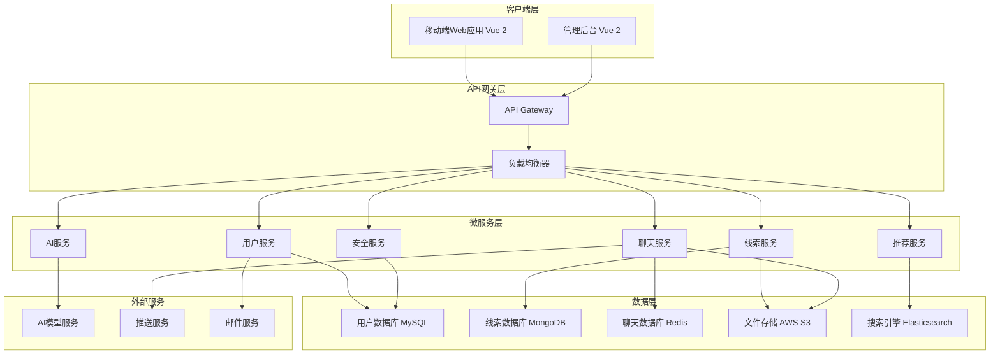

# ThreadBond 设计文档

## 概述

ThreadBond 是一款创新的匿名线索社交移动端 Web 应用，通过独特的"解密"互动机制让用户能够在保持匿名的同时进行深度社交。系统采用微服务架构，支持高并发的匿名用户交互，集成 AI 服务提供智能线索生成和情绪分析功能。应用专为移动设备优化，提供原生应用般的用户体验，核心设计理念是在保护用户隐私的前提下，通过创新的解密互动机制为年轻用户群体提供更有趣、更走心的社交体验。

## 架构

### 整体架构



### 技术栈选择

**前端：**

- Vue 2 - 渐进式 Web 应用框架
- Vue Router - 路由管理
- Vuex - 状态管理
- Vant UI - 移动端 UI 组件库
- Axios - HTTP 客户端
- Viewport Meta - 移动端适配
- Touch Events - 触摸交互支持

**后端：**

- Node.js 18+ + Express.js - 微服务框架
- Passport.js - 安全认证
- Socket.IO - 实时通信
- Prisma - ORM 框架
- JWT - 身份验证
- TypeScript - 类型安全

**数据库：**

- MySQL 8.0 - 主数据库
- Redis - 缓存和会话存储
- Elasticsearch - 搜索引擎（可选）

**AI 服务：**

- OpenAI GPT API - 线索生成
- 情感分析模型 - 聊天情绪分析
- 推荐算法 - 内容推荐

**移动端优化：**

- PWA 支持 - 离线缓存和安装提示
- 响应式设计 - 适配各种移动设备屏幕
- 触摸优化 - 手势操作和触摸反馈
- 性能优化 - 懒加载和代码分割

## 组件和接口

### 核心组件

#### 1. 用户管理组件 (UserService)

**职责：**

- 用户注册和身份验证（仅需邮箱验证）
- 匿名身份自动生成和管理
- 用户偏好设置和隐私保护
- 真实身份与匿名身份完全隔离

**主要接口：**

```typescript
// /api/users 路由
class UserController {
  async registerUser(req: Request, res: Response): Promise<Response<User>>;
  async authenticateUser(
    req: Request,
    res: Response
  ): Promise<Response<AuthToken>>;
  async generateAnonymousIdentity(
    req: Request,
    res: Response
  ): Promise<Response<AnonymousIdentity>>;
  async updateUserPreferences(
    req: Request,
    res: Response
  ): Promise<Response<void>>;
  async deleteUser(req: Request, res: Response): Promise<Response<void>>;
}
```

#### 2. 线索管理组件 (ClueService)

**职责：**

- 线索卡创建和编辑（支持文字、图片、音频等多种类型）
- 线索内容存储和检索
- 解密逻辑处理和答案验证
- 解密难度级别设置
- 线索池管理和发布
- 解密历史和成功率统计

**主要接口：**

```typescript
// /api/clues 路由
class ClueController {
  async createClue(req: Request, res: Response): Promise<Response<Clue>>;
  async getClueById(req: Request, res: Response): Promise<Response<Clue>>;
  async getCluesForUser(req: Request, res: Response): Promise<Response<Clue[]>>;
  async attemptDecryption(
    req: Request,
    res: Response
  ): Promise<Response<DecryptionResult>>;
  async updateClue(req: Request, res: Response): Promise<Response<Clue>>;
  async deleteClue(req: Request, res: Response): Promise<Response<void>>;
}
```

#### 3. 聊天管理组件 (ChatService)

**职责：**

- 解密成功后自动创建匿名聊天房间
- 实时消息传递（文字、表情、图片）
- 聊天记录管理和保存
- 匿名性保护和身份揭示选项
- 聊天结束和房间管理

**主要接口：**

```typescript
// /api/chat 路由
class ChatController {
  async createChatRoom(
    req: Request,
    res: Response
  ): Promise<Response<ChatRoom>>;
  async sendMessage(req: Request, res: Response): Promise<Response<void>>;
  async getChatHistory(
    req: Request,
    res: Response
  ): Promise<Response<Message[]>>;
  async endChat(req: Request, res: Response): Promise<Response<void>>;
  async revealIdentity(req: Request, res: Response): Promise<Response<void>>;
}
```

#### 4. AI 辅助组件 (AIService)

**职责：**

- 线索创意建议和内容生成
- 个性化线索模板生成
- 聊天情绪分析和建议提供
- 用户偏好学习和推荐算法优化
- 隐私保护的AI分析处理

**主要接口：**

```typescript
// /api/ai 路由
class AIController {
  async generateClueIdeas(
    req: Request,
    res: Response
  ): Promise<Response<ClueIdea[]>>; // 根据用户输入提供创意建议
  async generatePersonalizedTemplate(
    req: Request,
    res: Response
  ): Promise<Response<ClueTemplate>>; // 生成符合用户个性的线索模板
  async analyzeClueContent(
    req: Request,
    res: Response
  ): Promise<Response<ClueAnalysis>>;
  async analyzeChatSentiment(
    req: Request,
    res: Response
  ): Promise<Response<SentimentAnalysis>>; // 分析对话情绪
  async generateChatSuggestions(
    req: Request,
    res: Response
  ): Promise<Response<string[]>>; // 提供聊天建议
  async optimizeRecommendations(
    req: Request,
    res: Response
  ): Promise<Response<void>>; // 学习用户偏好优化推荐
}
```

#### 5. 安全管理组件 (SecurityService)

**职责：**

- 用户举报和屏蔽功能
- 不当内容检测和过滤
- 数据导出和删除管理
- 隐私设置和数据保护
- 安全事件监控和处理

**主要接口：**

```typescript
// /api/security 路由
class SecurityController {
  async reportUser(req: Request, res: Response): Promise<Response<void>>;
  async blockUser(req: Request, res: Response): Promise<Response<void>>;
  async requestDataExport(
    req: Request,
    res: Response
  ): Promise<Response<DataExport>>;
  async deleteUserData(req: Request, res: Response): Promise<Response<void>>;
  async updatePrivacySettings(
    req: Request,
    res: Response
  ): Promise<Response<void>>;
  async scanContent(
    req: Request,
    res: Response
  ): Promise<Response<ContentScanResult>>;
}
```

#### 6. 推荐引擎组件 (RecommendationService)

**职责：**

- 基于用户兴趣和行为的线索推荐算法
- 线索分类和搜索功能
- 热门线索和趋势分析
- 新老用户曝光平衡算法
- 个性化内容推荐和用户匹配

**主要接口：**

```typescript
// /api/recommendations 路由
class RecommendationController {
  async getRecommendedClues(
    req: Request,
    res: Response
  ): Promise<Response<Clue[]>>;
  async getTrendingClues(
    req: Request,
    res: Response
  ): Promise<Response<Clue[]>>;
  async updateUserInteractionData(
    req: Request,
    res: Response
  ): Promise<Response<void>>;
  async getPersonalizedFeed(
    req: Request,
    res: Response
  ): Promise<Response<FeedItem[]>>;
}
```

## 数据模型

### 用户相关模型

```typescript
// Prisma Schema 定义
interface User {
  id: string;
  email: string; // unique, required - 仅用于验证
  passwordHash: string; // required
  createdAt: Date;
  lastActiveAt?: Date;
  isActive: boolean; // default: true
  preferences?: UserPreferences;
  // 注意：不存储任何可识别的真实身份信息
}

interface AnonymousIdentity {
  id: string;
  userId: string;
  displayName: string; // 用户可选择的匿名昵称
  avatarUrl: string; // 用户可选择的匿名头像
  personalityTraits: string[];
  createdAt: Date;
  isAutoGenerated: boolean; // 标识是否为系统自动生成
}

interface UserPreferences {
  clueTypes: ClueType[]; // 偏好的线索类型
  difficultyLevel: DifficultyLevel; // 偏好的解密难度
  notificationSettings: NotificationSettings;
  privacySettings: PrivacySettings;
  dataRetentionSettings: DataRetentionSettings; // 数据保留设置
}
```

### 线索相关模型

```typescript
interface Clue {
  id: string;
  creatorId: string; // 关联匿名身份ID
  title: string;
  content: ClueContent;
  type: ClueType; // 文字、图片、音频等
  difficulty: DifficultyLevel; // 用户设置的难度级别
  solution: string; // 加密存储的答案
  hints: string[]; // 提示系统
  createdAt: Date;
  expiresAt?: Date;
  isActive: boolean; // 是否在线索池中可见
  decryptionCount: number; // 总尝试次数
  successfulDecryptions: number; // 成功解密次数
  tags: string[]; // 分类标签
  aiGenerated: boolean; // 是否使用AI辅助生成
}

interface ClueContent {
  text?: string;
  imageUrl?: string;
  audioUrl?: string;
  videoUrl?: string;
  interactiveElements?: InteractiveElement[];
}

interface DecryptionAttempt {
  id: string;
  userId: string; // 匿名身份ID
  clueId: string;
  answer: string;
  isCorrect: boolean;
  attemptedAt: Date;
  hintsUsed: number;
  attemptNumber: number; // 第几次尝试（限制尝试次数）
  chatRoomCreated?: string; // 成功后创建的聊天房间ID
}
```

### 聊天相关模型

```typescript
interface ChatRoom {
  id: string;
  participant1Id: string; // 线索创建者匿名ID
  participant2Id: string; // 解密者匿名ID
  clueId: string; // 触发聊天的线索ID
  createdAt: Date;
  lastMessageAt: Date;
  isActive: boolean;
  identityRevealed: boolean; // 双方是否同意揭示身份
  identityRevealedBy?: string[]; // 同意揭示身份的用户列表
  endedBy?: string; // 结束聊天的用户ID
  endedAt?: Date;
  autoCreated: boolean; // 解密成功后自动创建
}

interface Message {
  id: string;
  roomId: string;
  senderId: string; // 匿名身份ID
  content: MessageContent;
  type: MessageType; // 文字、表情、图片等
  sentAt: Date;
  isEncrypted: boolean; // 端到端加密
  readAt?: Date;
  sentimentScore?: number; // AI情绪分析结果
  isSystemMessage: boolean; // 系统消息标识
}

interface MessageContent {
  text?: string;
  imageUrl?: string;
  audioUrl?: string;
  emoji?: string;
  systemMessage?: string;
  aiSuggestion?: string; // AI生成的聊天建议
}

### 安全和隐私相关模型

```typescript
interface DataRetentionSettings {
  chatHistoryRetentionDays: number; // 聊天记录保留天数
  clueRetentionDays: number; // 线索保留天数
  autoDeleteEnabled: boolean; // 是否启用自动删除
}

interface SecurityReport {
  userId: string;
  reportType: ReportType; // 举报类型
  targetId: string; // 被举报对象ID
  reason: string;
  description?: string;
  reportedAt: Date;
  status: ReportStatus;
  reviewedBy?: string;
  reviewedAt?: Date;
}

interface UserDataExport {
  userId: string;
  requestedAt: Date;
  exportType: ExportType; // 导出类型（全部数据、聊天记录等）
  status: ExportStatus;
  downloadUrl?: string;
  expiresAt?: Date;
}
```
```

## 错误处理

### 错误分类和处理策略

#### 1. 用户输入错误

- **验证错误：** 客户端实时验证 + 服务端二次验证
- **格式错误：** 统一错误消息格式，提供具体修正建议
- **权限错误：** 清晰的权限提示，引导用户正确操作

#### 2. 系统错误

- **数据库连接错误：** 自动重试机制 + 降级服务
- **外部服务错误：** 熔断器模式 + 备用方案
- **网络错误：** 指数退避重试 + 离线模式支持

#### 3. 业务逻辑错误

- **解密失败：** 提供提示系统，限制尝试次数
- **聊天异常：** 自动恢复机制 + 数据备份
- **AI 服务异常：** 降级到预设模板 + 人工审核

### 错误监控和日志

```typescript
interface ErrorHandler {
  logError(error: AppError, context: ErrorContext): void;
  notifyAdmins(criticalError: CriticalError): void;
  generateErrorReport(timeRange: TimeRange): ErrorReport;
  trackErrorMetrics(errorType: ErrorType): void;
}

interface AppError {
  code: string;
  message: string;
  severity: ErrorSeverity;
  timestamp: Date;
  userId?: string;
  stackTrace: string;
  context: Record<string, any>;
}
```

## 测试策略

### 测试层级

#### 1. 单元测试

- **覆盖率目标：** 90%以上
- **重点测试：** 业务逻辑、数据验证、加密解密
- **工具：** Jest + Supertest + Docker Compose

#### 2. 集成测试

- **API 测试：** 所有接口的正常和异常流程
- **数据库测试：** 数据一致性和事务处理
- **外部服务测试：** Mock 服务 + 契约测试

#### 3. 端到端测试

- **用户流程测试：** 注册 → 创建线索 → 解密 → 聊天完整流程
- **性能测试：** 并发用户场景下的系统表现
- **安全测试：** 匿名性保护和数据安全验证

### 测试数据管理

```typescript
class TestDataManager {
  async createTestUser(profile: TestUserProfile): Promise<TestUser>;
  async createTestClue(difficulty: DifficultyLevel): Promise<TestClue>;
  async simulateDecryptionAttempt(success: boolean): Promise<DecryptionResult>;
  async cleanupTestData(): Promise<void>;
}
```

### 自动化测试流程

- **持续集成：** 每次代码提交触发自动测试
- **回归测试：** 发布前完整测试套件执行
- **性能基准：** 定期性能测试和基准对比
- **安全扫描：** 自动化安全漏洞检测

## 安全设计

### 数据保护

#### 1. 加密策略

- **传输加密：** TLS 1.3 端到端加密
- **存储加密：** AES-256 数据库字段加密
- **消息加密：** Signal 协议实现端到端聊天加密

#### 2. 匿名性保护

- **身份隔离：** 真实身份与匿名身份完全分离，系统确保社交互动中不泄露真实信息
- **数据脱敏：** 日志和分析数据中移除可识别信息
- **访问控制：** 基于角色的细粒度权限管理
- **数据清理：** 定期清理过期聊天记录和个人数据
- **用户控制：** 提供数据导出和删除选项，遵循隐私法规

#### 3. 内容安全

- **内容过滤：** AI 驱动的不当内容自动检测和过滤
- **举报机制：** 快速响应的用户举报和屏蔽功能
- **审核流程：** 人工审核 + 自动化审核结合
- **实时监控：** 检测到不当内容时自动警告或过滤
- **用户保护：** 提供屏蔽和举报功能防止恶意行为

### 安全监控

```typescript
class SecurityMonitor {
  detectSuspiciousActivity(userId: string, activity: UserActivity): ThreatLevel;
  trackFailedAttempts(type: AttemptType, identifier: string): void;
  generateSecurityReport(timeRange: TimeRange): SecurityReport;
  alertSecurityTeam(incident: SecurityIncident): void;
}
```

## 性能优化

### 缓存策略

- **Redis 缓存：** 热点数据和会话信息
- **CDN 缓存：** 静态资源和媒体文件
- **应用缓存：** 计算结果和推荐数据

### 数据库优化

- **索引策略：** 基于查询模式的复合索引
- **分片策略：** 按用户 ID 和时间分片
- **读写分离：** 主从复制 + 读写分离

### 实时通信优化

- **WebSocket 管理：** Socket.IO + Redis Adapter
- **消息队列：** Redis Pub/Sub + Bull Queue 消息持久化
- **负载均衡：** Nginx + PM2 集群模式
