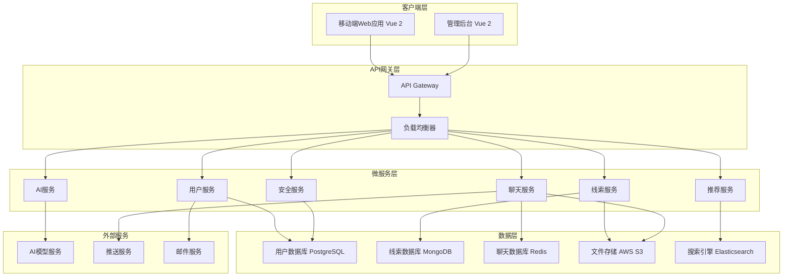

# ThreadBond 设计文档

## 概述

ThreadBond 是一款基于线索解密机制的匿名社交移动端 Web 应用。系统采用微服务架构，支持高并发的匿名用户交互，集成 AI 服务提供智能线索生成和情绪分析功能。应用专为移动设备优化，提供原生应用般的用户体验，核心设计理念是在保护用户隐私的前提下，通过创新的解密互动机制促进深度社交连接。

## 架构

### 整体架构



### 技术栈选择

**前端：**

- Vue 2 - 渐进式 Web 应用框架
- Vue Router - 路由管理
- Vuex - 状态管理
- Vant UI - 移动端 UI 组件库
- Axios - HTTP 客户端
- Viewport Meta - 移动端适配
- Touch Events - 触摸交互支持

**后端：**

- Java 17 + Spring Boot - 微服务框架
- Spring Security - 安全认证
- Spring WebSocket - 实时通信
- MyBatis Plus - ORM 框架
- JWT - 身份验证

**数据库：**

- MySQL 8.0 - 主数据库
- Redis - 缓存和会话存储
- Elasticsearch - 搜索引擎（可选）

**AI 服务：**

- OpenAI GPT API - 线索生成
- 情感分析模型 - 聊天情绪分析
- 推荐算法 - 内容推荐

**移动端优化：**

- PWA 支持 - 离线缓存和安装提示
- 响应式设计 - 适配各种移动设备屏幕
- 触摸优化 - 手势操作和触摸反馈
- 性能优化 - 懒加载和代码分割

## 组件和接口

### 核心组件

#### 1. 用户管理组件 (UserService)

**职责：**

- 用户注册和身份验证
- 匿名身份生成和管理
- 用户偏好设置

**主要接口：**

```java
@RestController
@RequestMapping("/api/users")
public class UserController {
    ResponseEntity<User> registerUser(@RequestBody RegisterRequest request);
    ResponseEntity<AuthToken> authenticateUser(@RequestBody LoginRequest request);
    ResponseEntity<AnonymousIdentity> generateAnonymousIdentity(@PathVariable String userId);
    ResponseEntity<Void> updateUserPreferences(@PathVariable String userId, @RequestBody UserPreferences preferences);
    ResponseEntity<Void> deleteUser(@PathVariable String userId);
}
```

#### 2. 线索管理组件 (ClueService)

**职责：**

- 线索卡创建和编辑
- 线索内容存储和检索
- 解密逻辑处理

**主要接口：**

```java
@RestController
@RequestMapping("/api/clues")
public class ClueController {
    ResponseEntity<Clue> createClue(@RequestBody ClueCreateRequest request);
    ResponseEntity<Clue> getClueById(@PathVariable String clueId);
    ResponseEntity<List<Clue>> getCluesForUser(@PathVariable String userId, @RequestParam ClueFilters filters);
    ResponseEntity<DecryptionResult> attemptDecryption(@RequestBody DecryptionRequest request);
    ResponseEntity<Clue> updateClue(@PathVariable String clueId, @RequestBody ClueUpdateRequest request);
    ResponseEntity<Void> deleteClue(@PathVariable String clueId);
}
```

#### 3. 聊天管理组件 (ChatService)

**职责：**

- 匿名聊天房间创建
- 实时消息传递
- 聊天记录管理

**主要接口：**

```java
@RestController
@RequestMapping("/api/chat")
public class ChatController {
    ResponseEntity<ChatRoom> createChatRoom(@RequestBody ChatRoomCreateRequest request);
    ResponseEntity<Void> sendMessage(@RequestBody MessageSendRequest request);
    ResponseEntity<List<Message>> getChatHistory(@PathVariable String roomId, @RequestParam int limit, @RequestParam int offset);
    ResponseEntity<Void> endChat(@PathVariable String roomId, @RequestParam String userId);
    ResponseEntity<Void> revealIdentity(@PathVariable String roomId, @RequestParam String userId);
}
```

#### 4. AI 辅助组件 (AIService)

**职责：**

- 线索内容生成
- 聊天情绪分析
- 个性化推荐

**主要接口：**

```java
@RestController
@RequestMapping("/api/ai")
public class AIController {
    ResponseEntity<List<ClueIdea>> generateClueIdeas(@RequestBody UserContext userContext);
    ResponseEntity<ClueAnalysis> analyzeClueContent(@RequestBody String content);
    ResponseEntity<SentimentAnalysis> analyzeChatSentiment(@RequestBody List<Message> messages);
    ResponseEntity<List<String>> generateChatSuggestions(@RequestBody ChatContext chatContext);
}
```

#### 5. 推荐引擎组件 (RecommendationService)

**职责：**

- 线索推荐算法
- 用户匹配逻辑
- 内容个性化

**主要接口：**

```java
@RestController
@RequestMapping("/api/recommendations")
public class RecommendationController {
    ResponseEntity<List<Clue>> getRecommendedClues(@PathVariable String userId, @RequestParam int limit);
    ResponseEntity<List<Clue>> getTrendingClues(@RequestParam int limit);
    ResponseEntity<Void> updateUserInteractionData(@PathVariable String userId, @RequestBody UserInteraction interaction);
    ResponseEntity<List<FeedItem>> getPersonalizedFeed(@PathVariable String userId);
}
```

## 数据模型

### 用户相关模型

```java
@Entity
@Table(name = "users")
public class User {
    @Id
    private String id;

    @Column(unique = true, nullable = false)
    private String email;

    @Column(nullable = false)
    private String passwordHash;

    @CreationTimestamp
    private LocalDateTime createdAt;

    private LocalDateTime lastActiveAt;

    @Column(nullable = false)
    private Boolean isActive = true;

    @OneToOne(cascade = CascadeType.ALL)
    private UserPreferences preferences;
}

interface AnonymousIdentity {
  id: string
  userId: string
  displayName: string
  avatarUrl: string
  personalityTraits: string[]
  createdAt: Date
}

interface UserPreferences {
  clueTypes: ClueType[]
  difficultyLevel: DifficultyLevel
  notificationSettings: NotificationSettings
  privacySettings: PrivacySettings
}
```

### 线索相关模型

```typescript
interface Clue {
  id: string;
  creatorId: string;
  title: string;
  content: ClueContent;
  type: ClueType;
  difficulty: DifficultyLevel;
  solution: string;
  hints: string[];
  createdAt: Date;
  expiresAt?: Date;
  isActive: boolean;
  decryptionCount: number;
  successfulDecryptions: number;
  tags: string[];
}

interface ClueContent {
  text?: string;
  imageUrl?: string;
  audioUrl?: string;
  videoUrl?: string;
  interactiveElements?: InteractiveElement[];
}

interface DecryptionAttempt {
  id: string;
  userId: string;
  clueId: string;
  answer: string;
  isCorrect: boolean;
  attemptedAt: Date;
  hintsUsed: number;
}
```

### 聊天相关模型

```typescript
interface ChatRoom {
  id: string;
  participant1Id: string;
  participant2Id: string;
  clueId: string;
  createdAt: Date;
  lastMessageAt: Date;
  isActive: boolean;
  identityRevealed: boolean;
  endedBy?: string;
  endedAt?: Date;
}

interface Message {
  id: string;
  roomId: string;
  senderId: string;
  content: MessageContent;
  type: MessageType;
  sentAt: Date;
  isEncrypted: boolean;
  readAt?: Date;
}

interface MessageContent {
  text?: string;
  imageUrl?: string;
  audioUrl?: string;
  emoji?: string;
  systemMessage?: string;
}
```

## 错误处理

### 错误分类和处理策略

#### 1. 用户输入错误

- **验证错误：** 客户端实时验证 + 服务端二次验证
- **格式错误：** 统一错误消息格式，提供具体修正建议
- **权限错误：** 清晰的权限提示，引导用户正确操作

#### 2. 系统错误

- **数据库连接错误：** 自动重试机制 + 降级服务
- **外部服务错误：** 熔断器模式 + 备用方案
- **网络错误：** 指数退避重试 + 离线模式支持

#### 3. 业务逻辑错误

- **解密失败：** 提供提示系统，限制尝试次数
- **聊天异常：** 自动恢复机制 + 数据备份
- **AI 服务异常：** 降级到预设模板 + 人工审核

### 错误监控和日志

```typescript
interface ErrorHandler {
  logError(error: AppError, context: ErrorContext): void;
  notifyAdmins(criticalError: CriticalError): void;
  generateErrorReport(timeRange: TimeRange): ErrorReport;
  trackErrorMetrics(errorType: ErrorType): void;
}

interface AppError {
  code: string;
  message: string;
  severity: ErrorSeverity;
  timestamp: Date;
  userId?: string;
  stackTrace: string;
  context: Record<string, any>;
}
```

## 测试策略

### 测试层级

#### 1. 单元测试

- **覆盖率目标：** 90%以上
- **重点测试：** 业务逻辑、数据验证、加密解密
- **工具：** JUnit 5 + Mockito + TestContainers

#### 2. 集成测试

- **API 测试：** 所有接口的正常和异常流程
- **数据库测试：** 数据一致性和事务处理
- **外部服务测试：** Mock 服务 + 契约测试

#### 3. 端到端测试

- **用户流程测试：** 注册 → 创建线索 → 解密 → 聊天完整流程
- **性能测试：** 并发用户场景下的系统表现
- **安全测试：** 匿名性保护和数据安全验证

### 测试数据管理

```java
@Component
public class TestDataManager {
    public TestUser createTestUser(TestUserProfile profile);
    public TestClue createTestClue(DifficultyLevel difficulty);
    public DecryptionResult simulateDecryptionAttempt(boolean success);
    public void cleanupTestData();
}
```

### 自动化测试流程

- **持续集成：** 每次代码提交触发自动测试
- **回归测试：** 发布前完整测试套件执行
- **性能基准：** 定期性能测试和基准对比
- **安全扫描：** 自动化安全漏洞检测

## 安全设计

### 数据保护

#### 1. 加密策略

- **传输加密：** TLS 1.3 端到端加密
- **存储加密：** AES-256 数据库字段加密
- **消息加密：** Signal 协议实现端到端聊天加密

#### 2. 匿名性保护

- **身份隔离：** 真实身份与匿名身份完全分离
- **数据脱敏：** 日志和分析数据中移除可识别信息
- **访问控制：** 基于角色的细粒度权限管理

#### 3. 内容安全

- **内容过滤：** AI 驱动的不当内容检测
- **举报机制：** 快速响应的用户举报处理
- **审核流程：** 人工审核 + 自动化审核结合

### 安全监控

```java
@Service
public class SecurityMonitor {
    public ThreatLevel detectSuspiciousActivity(String userId, UserActivity activity);
    public void trackFailedAttempts(AttemptType type, String identifier);
    public SecurityReport generateSecurityReport(TimeRange timeRange);
    public void alertSecurityTeam(SecurityIncident incident);
}
```

## 性能优化

### 缓存策略

- **Redis 缓存：** 热点数据和会话信息
- **CDN 缓存：** 静态资源和媒体文件
- **应用缓存：** 计算结果和推荐数据

### 数据库优化

- **索引策略：** 基于查询模式的复合索引
- **分片策略：** 按用户 ID 和时间分片
- **读写分离：** 主从复制 + 读写分离

### 实时通信优化

- **WebSocket 管理：** Spring WebSocket + STOMP 协议
- **消息队列：** Redis Pub/Sub + RabbitMQ 消息持久化
- **负载均衡：** Nginx + Spring Cloud Gateway
